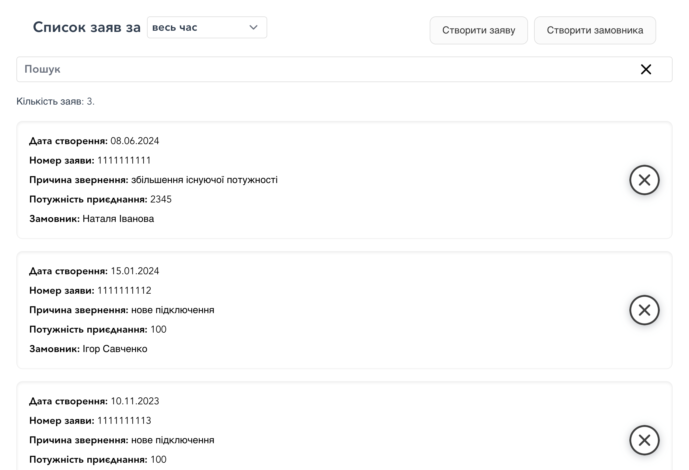
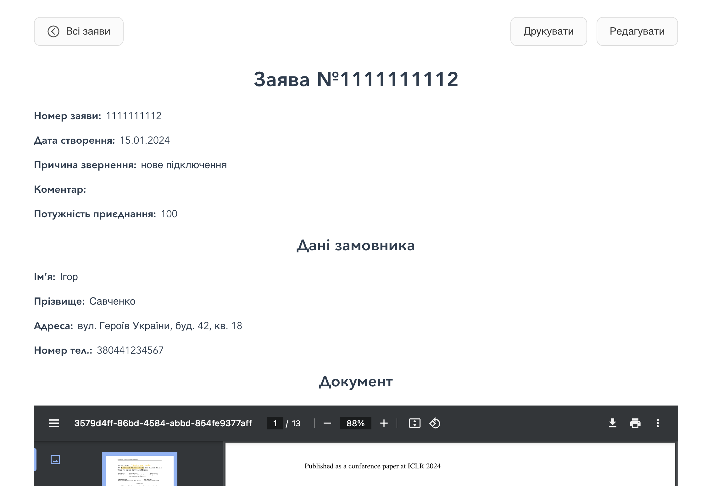

# Application Management System

A web application for managing requests related to connecting to the power grid. It provides functionality for users to input, store, search, edit, and print applications along with associated customer data and attached documents.

## Features

- **Create Application**:

   Users can enter details such as application number, creation date, reason for application (e.g., new connection, increased power capacity), comment, and power capacity.

- **Create Customer Data**:

   Store customer information including name, address, and other details.

- **Document Attachment**:

   Capability to attach and view documents in formats like `.doc`, `.docx` and `.pdf`.

- **Search and Filter**:

   Users can search and filter a list of saved applications within specific date ranges.

- **Open and Edit**:

   Ability to open saved applications for viewing and editing, with updates reflecting in the application records.

- **Print Application**:

   Functionality to generate and print application details in a structured format.

### Pages Overview

1. **Main page**: Displays a list of created applications with essential details for quick reference.
   

2. **Single Application page**: Displays a single applications with all details.
   

3. **Create Application page**: Allows users to input and save the details of an application.
   

4. **Create Client page**: Allows users to create and save a new client.
   

## Installation

To run the application locally, follow these steps:

1. Clone the repository from GitHub:

   ```bash
   git clone https://github.com/kretsulaksusha/test-application
   cd test-application
   ```

2. Install dependencies:

   ```bash
   npm install
   cd src/server
   npm install
   ```

## Running the Application

1. Start the Vue.js Development Server from the root

   ```bash
   npm run serve
   ```
   This will start a development server for the Vue.js frontend. Open your browser and go to http://localhost:8080 to see the application.

2. Start the Node.js/Express Server

   ```bash
   cd src/server
   npm start
   ```
   This will start your Node.js server. By default, it will run on http://localhost:3000.

### Notes

Ensure both frontend and backend servers are running simultaneously for the full functionality of your application.
